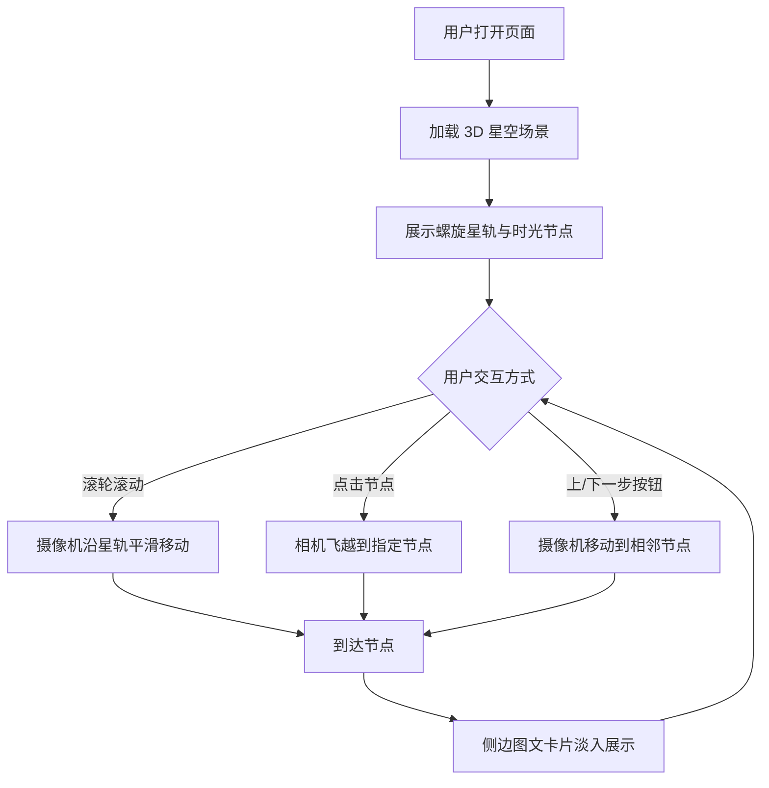

## 1. 产品概述

"3D 生命星轨"是一款沉浸式 3D 时光地图应用，将人生或宠物的生命历程以璀璨的 3D 螺旋星轨形式呈现。用户可以在星空背景下，沿着螺旋时间轴探索每一个重要的人生阶段，感受生命的厚度与仪式感。
- 核心目标：用 3D 视觉降维打击传统电子相册，为宠物主和为人子女者提供极致的情感寄托产品
- 目标市场：情感消费、银发经济、宠物经济，面向精致养宠党、宠物离世疗愈群体、为人子女者

## 2. 核心功能

### 2.1 用户角色
| 角色 | 注册方式 | 核心权限 |
|------|----------|----------|
| 普通用户 | 无需注册 | 浏览和体验 3D 时光地图 |
| 定制用户 | 微信授权 | 上传照片、生成个性化星轨、分享 |

### 2.2 功能模块
1. **星轨主页**：3D 螺旋星轨场景、星空背景、时光节点、摄像机跟随、图文卡片展示
2. **节点详情**：点击节点飞越、侧边图文卡片淡入淡出、上下步导航

### 2.3 页面详情
| 页面名称 | 模块名称 | 功能描述 |
|----------|----------|----------|
| 星轨主页 | 3D 场景 | 暗色调星空背景（粒子系统实现星光闪烁），中心螺旋曲线作为生命时间轴 |
| 星轨主页 | 时光节点 | 沿螺旋曲线等距放置 6 个发光交互球体，代表人生阶段 |
| 星轨主页 | 摄像机跟随 | 滚轮/按钮控制摄像机沿螺旋曲线平滑移动（GSAP 插值动画） |
| 星轨主页 | 图文卡片 | 摄像机到达节点时，侧边淡入淡出展示该阶段的宠物/人生故事 |
| 星轨主页 | 节点飞越 | 点击 3D 球体节点，相机自动飞越到该节点前方 |
| 星轨主页 | 导航控制 | 上一步/下一步按钮，支持滚轮交互 |

## 3. 核心流程

用户打开页面 → 看到 3D 星空场景和螺旋星轨 → 滚轮或按钮控制摄像机沿星轨移动 → 到达节点时侧边弹出图文卡片 → 点击节点可飞越到指定位置 → 浏览完整生命历程

## 4. 用户界面设计

### 4.1 设计风格
- 主色调：深邃星空黑（#0a0a1a）+ 星光金（#ffd700）+ 极光蓝（#00d4ff）
- 辅助色：星云紫（#8b5cf6）、暖光橙（#ff6b35）
- 按钮风格：半透明毛玻璃效果，圆角，hover 时发光
- 字体：展示标题使用 ZCOOL XiaoWei（站酷小薇），正文使用 Noto Sans SC
- 布局：全屏 3D 场景 + 右侧浮动图文卡片 + 底部导航控制条
- 图标风格：线性描边图标，带微光效果

### 4.2 页面设计概览
| 页面名称 | 模块名称 | UI 元素 |
|----------|----------|----------|
| 星轨主页 | 3D 场景层 | 全屏 Three.js Canvas，深色星空背景，螺旋曲线发光，节点球体脉冲发光 |
| 星轨主页 | 图文卡片层 | 右侧固定定位卡片，毛玻璃背景，年份标题+描述+图片，淡入淡出动画 |
| 星轨主页 | 导航控制层 | 底部居中控制条，上一步/下一步按钮，当前节点指示器，滚轮提示 |

### 4.3 响应式设计
- 桌面优先设计，全屏 3D 体验
- 移动端适配：卡片改为底部弹出，按钮放大便于触摸操作
- 触摸优化：支持手势滑动替代滚轮

### 4.4 3D 场景指引
- 环境：深空暗色调，无 HDRI，纯代码粒子星空
- 灯光：微弱环境光 + 节点点光源（暖色脉冲）
- 摄像机：透视相机，沿螺旋曲线运动，始终朝向曲线切线方向
- 构图：螺旋曲线从场景底部向顶部延伸，节点均匀分布
- 交互：滚轮驱动摄像机移动，点击节点飞越，OrbitControls 仅允许有限旋转
- 后期效果：节点发光（UnrealBloomPass），星轨线条发光
- 资源：无外部模型/图片依赖，全部 Three.js 原生实现
