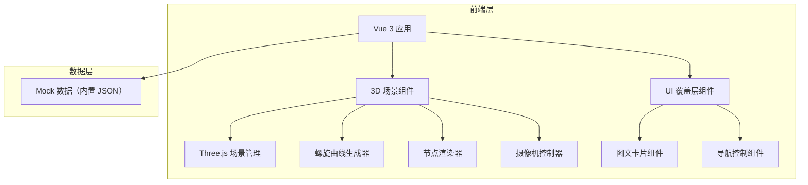
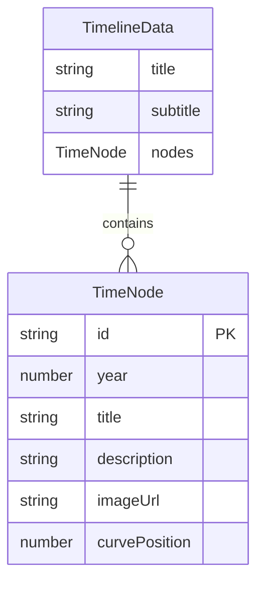

## 1. 架构设计



## 2. 技术说明
- 前端：Vue 3 + TypeScript + Vite + TailwindCSS
- 初始化工具：vite-init (vue-ts 模板)
- 3D 渲染：Three.js + @types/three
- 动画：GSAP（摄像机平滑移动、UI 淡入淡出）
- 后处理：Three.js 后处理通道（UnrealBloomPass 发光效果）
- 后端：无（纯前端 MVP）
- 数据：内置 Mock JSON 数据

## 3. 路由定义
| 路由 | 用途 |
|------|------|
| / | 星轨主页，展示 3D 螺旋时光地图 |

## 4. API 定义
无后端 API，所有数据为前端内置 Mock 数据。

## 5. 数据模型

### 5.1 数据模型定义



### 5.2 数据定义

```typescript
interface TimeNode {
  id: string
  year: number
  title: string
  description: string
  imageUrl: string
  curvePosition: number // 0-1 在曲线上的位置
}

interface TimelineData {
  title: string
  subtitle: string
  nodes: TimeNode[]
}
```

### 5.3 Mock 数据

内置 6 个人生/宠物阶段节点：
1. 2018 - 初遇 - "那个秋天的午后，你在纸箱里怯怯地探出小脑袋..."
2. 2019 - 成长 - "你学会了奔跑，整个公园都是你的游乐场..."
3. 2020 - 陪伴 - "居家办公的日子里，你是最温暖的存在..."
4. 2022 - 冒险 - "第一次看到大海，你兴奋得像个孩子..."
5. 2024 - 沉稳 - "你不再像从前那样疯跑，但眼神依然温柔..."
6. 2026 - 永恒 - "有些爱不会因时间而消逝，只会化作星轨上的光..."
